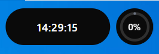
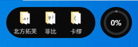
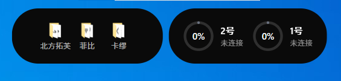
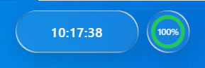
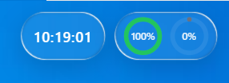
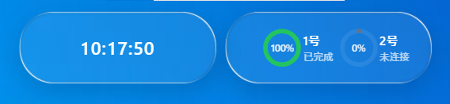
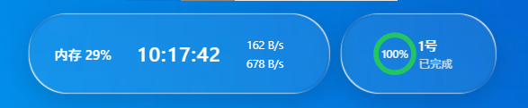

# Island STL

Windows 桌面浮动胶囊，液态玻璃效果实时显示系统状态和 3D 打印机进度。

## 功能

- **液态玻璃效果** — WebGL 渲染的实时折射、高光、Fresnel 反射，桌面内容作为折射源
- **经典模式** — 关闭 WebGL 效果，纯深色面板，适合低性能设备
- **时间显示** — 实时时钟，展开后显示内存使用率和网络速度
- **快捷方式** — 拖拽文件夹添加，点击快速打开
- **打印机监控** — 通过 MQTT 连接 Bambu Lab 打印机，实时显示打印进度、剩余时间
- **多打印机** — 支持同时监控多台打印机，优先显示即将完成的打印机
- **黑名单屏蔽** — 指定进程在前台时自动隐藏胶囊
- **系统托盘** — 右键菜单快速访问设置
- **开机自启** — Windows 注册表实现
- **玻璃参数调节** — 折射厚度、高光强度、阴影、色调等全部可调，支持保存预设

## 截图

### 单打印机模式

| 时间模式 | 快捷方式模式 |
|---------|------------|
|  |  |

### 多打印机模式

| 时间模式 | 快捷方式模式 |
|---------|------------|
|  |  |

### 液态玻璃主题

| 单打印机 | 双打印机 |
|---------|---------|
|  |  |

| 双打印机展开 | 单打印机展开 |
|------------|------------|
|  |  |

## 技术栈

- **前端**: JavaScript + WebGL2（无框架）
- **后端**: Rust (Tauri 2)
- **玻璃渲染**: GLSL 着色器（折射、色散、Fresnel、高光、模糊）
- **打印机通信**: MQTT (rumqttc + rustls)
- **屏幕截图**: GDI BitBlt（作为玻璃折射源）
- **系统API**: Win32 (GlobalMemoryStatusEx, GetIfTable)

## 安装

### 从 Releases 下载

前往 [Releases](https://github.com/molian313/island-stl/releases) 下载最新安装包。

### 从源码构建

```bash
# 安装依赖
npm install

# 开发模式
npm run tauri dev

# 构建安装包
npm run tauri build
```

### 前置要求

- [Node.js](https://nodejs.org/) 18+
- [Rust](https://www.rust-lang.org/tools/install)
- [Tauri Prerequisites](https://v2.tauri.app/start/prerequisites/)

## 配置打印机

在设置面板中添加打印机配置：

| 字段 | 说明 | 示例 |
|------|------|------|
| 名称 | 打印机昵称 | 1号 |
| IP 地址 | 打印机局域网 IP | 192.168.0.109 |
| 访问码 | Bambu Lab MQTT access code | 82d8f3a6 |
| 序列号 | 打印机序列号 | 01P00C5C3912189 |

配置文件保存在 `%APPDATA%\dynamic-island\printers_config.json`

## 操作方式

| 操作 | 方式 |
|------|------|
| 展开/折叠 | 鼠标悬停胶囊顶部触发区 |
| 最小化 | 右键胶囊 → 收起 |
| 切换视图 | 双击左面板（时间 ↔ 快捷方式） |
| 切换单/多打印机 | 双击右面板 |
| 添加快捷方式 | 拖拽文件夹到胶囊 |
| 删除快捷方式 | 展开后拖拽图标出胶囊 |
| 调节玻璃效果 | 设置 → 玻璃参数 |

## 项目结构

```
├── src/                        # 前端模块
│   ├── main.js                # 入口，初始化所有模块
│   ├── dom.js                 # DOM 元素引用
│   ├── state.js               # 全局状态
│   ├── tauri-init.js          # Tauri 模式初始化（截图、设置同步）
│   ├── settings-init.js       # 设置页面逻辑
│   └── modules/               # 功能模块
│       ├── capsule-interaction.js  # 胶囊展开/折叠
│       ├── brightness.js      # 亮度自适应
│       ├── minimize.js        # 最小化
│       ├── printer.js         # 打印机状态
│       ├── shortcut.js        # 快捷方式
│       └── view-switcher.js   # 视图切换
├── shaders/                    # GLSL 着色器
│   ├── vertex.glsl            # 顶点着色器
│   ├── fragment-bg.glsl       # 背景/截图合成
│   ├── fragment-vblur.glsl    # 垂直模糊
│   ├── fragment-hblur.glsl    # 水平模糊
│   └── fragment-main.glsl     # 主合成（折射、高光、阴影）
├── src-tauri/                 # Rust 后端
│   ├── src/
│   │   ├── lib.rs             # 入口 + 系统托盘
│   │   ├── printer.rs         # MQTT 打印机监控
│   │   ├── screencap.rs       # GDI 屏幕截图
│   │   ├── shortcuts.rs       # 快捷方式 CRUD
│   │   ├── settings.rs        # 设置持久化
│   │   ├── window.rs          # 窗口控制 + 黑名单 + 点击穿透
│   │   ├── sysinfo.rs         # 系统信息获取
│   │   └── icon.rs            # Windows 图标提取
│   └── tauri.conf.json
├── app.js                     # WebGL 渲染管线 + 弹簧物理
├── controls.js                # 玻璃参数控制面板
├── index.html                 # 主界面
└── settings.html              # 设置界面
```

## 许可证

MIT
